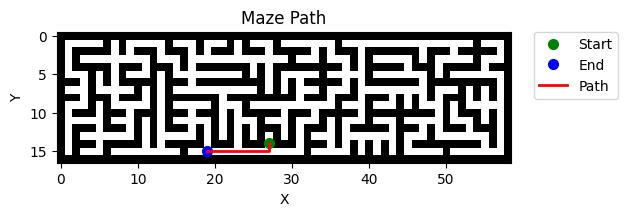

# Maze Solver

Maze Solver is a Python project that uses an A* pathfinding algorithm to find the shortest path through a randomly generated maze. The project also includes a maze generator based on a modified version of Kruskal's algorithm.



## Features
* Random Maze Generator
* A* Pathfinding Algorithm to solve the maze
* Maze and Path Visualizer

## Getting Started

### Prerequisites

Make sure you have Python 3.10 installed on your machine. You can download it from [here](https://www.python.org/downloads/).

### Installation

1. Clone the repo:

    ```bash
    git clone https://github.com/pietrykovsky/maze-solver.git
    cd maze-solver
    ```

2. Create a virtual environment and activate it:
    ```bash
    python -m venv venv
    
    .\venv\Scripts\activate (windows)
    or
    source venv/bin/activate (linux)
    ```

3. Install the required dependencies:

    ```bash
    pip install -r requirements.txt
    ```

## Usage

To generate a new maze and find the shortest path, run:

```python
python main.py
```


This will generate a new maze, solve it, and save a visualization of the maze and the path in the `plots` directory.

## Contributing

Pull requests are welcome. For major changes, please open an issue first to discuss what you would like to change.

## License

This project is licensed under the MIT License. See the [LICENSE](LICENSE) file for details.
